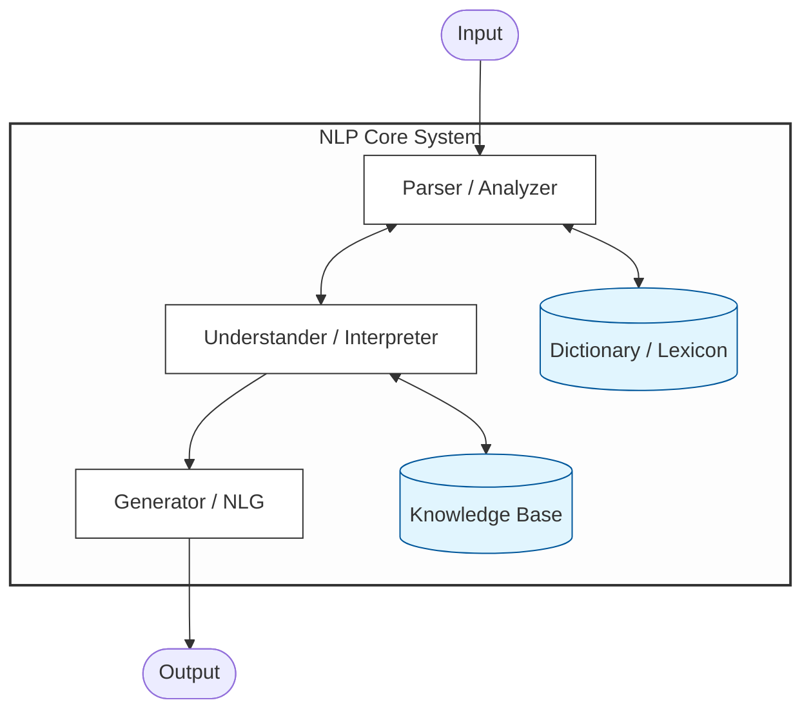
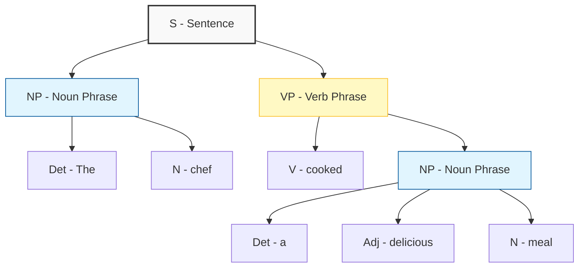

# Introduction to Natural Language Processing

Natural Language Processing is referred to as NLP in English literature. It is a subcategory of Artificial Intelligence.

In the world of computing, there are two distinct types of languages:
1. Machine Learning
2. Natural Languages

Programming languages are Context-Free (they have strict rules and no ambiguity), whereas Natural Languages are Context-Dependent and highly ambiguous (slang, sarcasm, metaphors), which is why NLP is so difficult for computers.

NLP is defined as the process by which machines take and process the language spoken by humans. In technical terms, NLP is usually divided into two main components:
1. Natural Language Understanding: how machines understand what we say;
2. Natural Language Generation: how machines produce human-like text.

## Purpose of NLP

The aim of NLP is to create systems capable of deriving meaning from text and performing tasks such as translation, grammar checking, topic classification.

## The NLP Pipeline

NLP processing is not a sigle step; it is a hierarchical sequence of analyses that allow a machine to understand human language. Because languages vary significantly, the system follows these levels:
1. Morphological and Lexical Analysis

The system identifies individual words and analyzes their internal structure. It breaks down words into **roots and affixes**.
* This is especially vital for agglutinative languages where a single word can convey complex meanings through multiple suffixes.

2. Syntactic Analysis (Parsing)

This stage focuses on the arrangement of words in a sentence. The goal is to understand the grammatical relationship between words and ensure the sentence follows the rules of the language's syntax.

3. Semantic Analysis

This level deals with the literal meaning of the text. It maps syntactic structures to their real-world meanings, attempting to resolve ambiguity in what the words actually represent.

4. Pragmatic and Discourse Analysis

Discourse analysis examines how the meaning of a sentence depends on the sentences that came before it. Pragmatics focuses on the context and intent. It helps the machine understand hidden meanings, such as sarcasm or metaphors, and the overall purpose of the conversation.

## Text Normalization

In the preprocessing stage of any NLP pipeline, the primary goal is to reduce the vocabulary size and group together different forms of the same word. This process is known as **Text Normalization**. Without this step, a computer would treat "walk", "walking", and "walked" as three entirely different concepts, thich is inefficient for analysis.

1. The Heuristic Approach: Stemming

Stemming is the process of reducing a word to its "stem" by crudely chopping off its suffixes. It is a heuristic method, meaning it follows a set of hard-coded rules (like if the word ends in -ing, remove it) rather than understanding the language's grammar.

A stem is the part of the word that remains after the chopping process. It is important to note that a stem does not always have to be a valid, meaningful word.

Because stemming is an aggressive process, it can lead to over-stemming. For example, in Turkish, words like yer (place), yemek (to eat), and yeter (enough) might all be reduced to the same stem: "-ye". The machine now treats three unrelated concepts as the same, leading to a loss of semantic context.

2. The Linguistic Approach: Lemmatization

Lemmatization is a more sophisticated and precise method of finding the base form of a word. Unlike stemming, it performs a full morphological analysis and usually checks a dictionary (lexicon) to ensure the result is accurate.

The Lemma is the result of this process (the canonical or dictionary form of the word).

Lemmatization understands the relationship between words. In English, Lemmatization is crucial because many words change their form entirely based on tense or quantity.

| Input Word | Stemming (Heuristic) | Lemmatization (Morphological) | Why the difference? |
| :--- | :--- | :--- | :--- |
| **Studies** | `studi` | **study** | Stemming just chops the "es". Lemma finds the dictionary form. |
| **Caring** | `car` | **care** | Stemming incorrectly reduces "caring" to "car". Lemma understands the verb "care". |
| **Went** | `went` | **go** | Stemming can't handle irregular verbs. Lemma recognizes "went" as a past tense of "go". |
| **Better** | `better` | **good** | Lemma connects the comparative adjective to its base form. |
| **Feet** | `feet` | **foot** | Lemma understands irregular plurals. |

Part-of-speach awareness:
- the word: Saw;
- stemming: returns saw;
- lemmatization:
  - if used as: He saw a bied, the lemma is see;
  - if used as: He used a saw, the lemma is saw.

3. Roots vs. Stems

While people often use these terms interchangeably, they are technically different. **Root** is the primary lexical unit that carries the core meaning and cannot be broken down further. **Stem** is the base form specifically used for attaching grammatical inflections. 

### Tokenization

Before normalization can occur, the text must be broken down into individual units. This process is called Tokenization. It is the act of splitting a sentence into smaller, meaningful units called tokens. Depending on the task, tokens can be individual words, numbers, punctuation marks, or even multi-word phrases. 

The way text is split depends on the tokenizer used. For example, some tokenizer trat "don't" as one token, while others split it into do and n't. The Natural Language Toolkit (NLTK) provides a standard function for this:

```python
import nltk
from nltk.tokenize import word_tokenize

text = "Let's look at the example to understand tokenization."
tokens = word_tokenize(text)
```

### Stemming Algorithms

1. Porter Stemmer
2. Snowball Stemmer
3. Lancaster Stemmer

## Core Architecture of an NLP System

A standard NLP system is composed of several functional blocks that interact with data sources to transform raw text into meaningful output. The data flow:

1. Input

The raw natural language data entered into the system.

2. The Parser/Analyzer

This component performs the Morphological and Syntactic analysis. It breaks down sentences into their grammatical structures. To identify words, roots, and parts of speech, the parser constantly consults a Lexicon/Dictionary. Without this, the system cannot distinguish between a noun and a verb. (interaction with dictionary)

3. The Understander/Interpreter

Once the sentence is parsed, this block performs Semantic and Pragmatic analysis. Its job is to determine what the sentence actually means in a given context. To resolve ambiguity, the Understander uses a Knowledge Base. This base contains world facts, logic rules, and domain-specific information.

4. The Generator

This is the Natural Language Generation phase. Once the system has decided on a meaning or a response, the Generator converts that abstract thought back into a grammatically correct human language sentence.

5. Output

The final result provided to the user.



Note: it is important to note that this modular architecture was the standard for years. In modern Deep Learning, these blocks are often merged into a single neural network.

## Syntactic Analysis

The Parser is the core component that analyzes the syntax (word order and grammar) of a sentence. It converts a flat string of words into a hierarchical Parse Tree.

Most parser are based on Noam Chomsky's theories. He proposed that language is built from recursive phrase structures. In English linguistics, we break a sentence down into two primary branches:

1. Noun Phrase (NP): the subject or the doer
2. Verb Phrase (VP): the action and its objects

Key abbreviation used in NLP parsing:
* S: sentence;
* NP: noun phrase
* VP: verb phrase
* Det: determiner (a, an, the)
* Adj: adjective
* N: noun
* V: verb

Let;s look at the English sentence: "The chef cooked a delicious meal". "The chef" is NP (subject). "cooked a delicious meal" is VP (predicate). 



### The role of the Lexicon

The Lexicon is a structured database containing all the words, roots, and meanings that the NLP program is designed to recogniize. It acts as the "vocabulary" of the system.

The Parser cannot function alone; it must constantly consult the Lexicon to perform syntactic and morphological analysis. Without a Lexicon, a computer sees text as just random characters.

Four primary Lexical operations

1. Tokenization

The system identifies individual units (tokens) from the input string to mach them against the entries in the Lexicon.

2. Morphological Analysis

The system analyzes the structure of the word to find its root or stem. It strips awat suffixes to determine if the base word exists in the Lexicon.

3. Lexicon Lookup

The system searches the database for the identified wprd or root to retrieve its grammatical properties.

4. Error Handling / Transformation

If a word is not found in the Lexicon, the system must handle the error. This can involve spell-checking, identifying the word as a proper noun, or using Out-of-Vocabulary protocols to guess the meaning based on context.

Note: a Lexicon contains more than definitions; it contains linguistic features.

