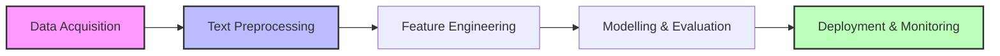

## NLP from fundamentals to pipeline implementation

Natural Language Processing (NLP) is a specialized branch of Artificial Intelligence and Computer Science dedicated to enabling machines to understand, process, and generate human language. It bridges the gap between human communication and machine-readable data.

The field has undergone three major paradigm shifts. During the **Rule-Based Era** (1950s-1960s), systems like ELIZA relied on hard-coded patterns and manual programming, offering high interpretability but lacking flexibility. The **Statistical & ML Era** (1970s-1990s) introduced probability-based models and supervised learning, such as Naive Bayes for spam detection, which allowed systems to learn from data quality. Currently, we are in the **Deep Learning Era (1990s-Present)**, dominated by Recurrent Neural Networks (RNNs) and the Transformer architecture. Modern Large Language Models (LLMs) like GPT leverage attention mechanisms to capture complex context and generate creative text at scale.

### The NLP Pipeline

The standard workflow for an NLP project follows a sequential structure designed to transform raw data into a deployable model.


1. Data Acquisition: Gathering raw text through web scraping, APIs, or public datasets;
2. Text Preprocessing: Cleaning and normalizing data to improve model focus;
3. Feature Engineering: Transforming text into numerical representations;
4. Modeling & Evaluation: Applying ML/DL algorithms and measuring performance using metrics like accuracy, f1-score, or BLEU;
5. Deployment: Serving the model via APIs and monitoring for data drift.

### Text Preprocessing Techniques

Noise Removal functions as the first line of defense by stripping away irrelevant elements such as URLs, HTML tags, and special characters using Regular Expressions (Regex). They reduce the dimensionality of the data and allows the model to focus on semantic content. Normalization further standardizes the text through case folding and accent removal, ensuring that variations like 'Apple' and 'apple' are treated as the same token.

Tokenization is the process of segmenting a character stream into meaningful units called tokens. While whitespace tokenization is common in English, more complex methods like Byte Pair Encoding (BPE) are used in Transformer models to handle rare words. Stopword Removal follows this by eliminating high-frequency words that carry little unique information, thereby accelerating processing speeds.

Stemming and Lemmatization reduce words to their base forms. Stemming is a heuristic process that chops off suffixes, whereas Lemmatization uses a dictionary to find the linguistically correct root. To capture local context, N-grams are generated to group consecutive tokens, and Part-of-Speech (POS) Tagging is applied to assign grammatical categories, helping resolve ambiguities where a word like book could be either a noun or a verb.

The primary obstacle in NLP is **Ambiguity**. This occurs at the **Lexical level**, the **Syntactic level**, and the **Semantic level** (contextual meaning). Furthermore, **Agglutinative languages** present unique difficulties because word meanings are modified through extensive suffixation, requiring language-specific tools for effective lemmatization.

The following Python snippet demonstrates a basic preprocessing routine:

```python
import re
import unicodedata
from nltk.tokenize import word_tokenize
from nltk.stem import WordNetLemmatizer

def preprocess_text(raw_text):
  clean = re.sub(r'http\S+|[^\w\s]', '', raw_text)

  normalized = unicodedata.normalize('NFKD', clean).lower()

  tokens = word_tokenize(normalized)
  lemmatizer = WordNetLemmatizer()

  return [lemmatizer.lemmatize(token) for token in tokens]

text = "The running dogs were at https://example.com!"
print(preprocess_text(text))
# output: ['the', 'running', 'dog', 'were', 'at']
```

To measure the success of preprocessing and modeling, developers track **Vocabulary Reduction**, which monitors how much the unique word count shrinks after cleaning. 

